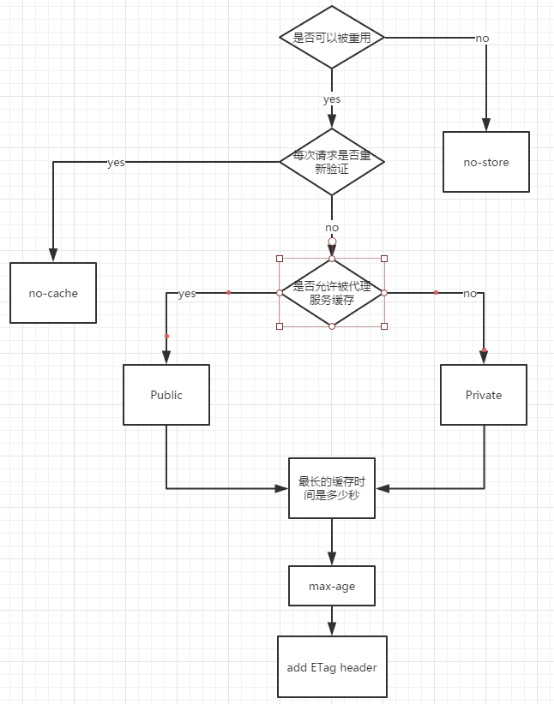
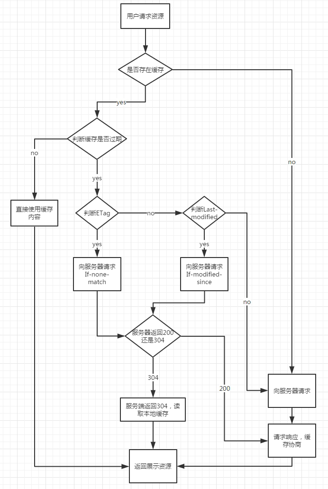

# 缓存

## 浏览器缓存

### 强缓存

- Expires

- Cache-Control

***
 Cache-Control 比 Expires 优先级高
***

### 协商缓存

缓存命中会返回http状态：304，并显示Not Modifyed字符串

利用的是Header 中的[Last-Modified, If-Modified-Since] 和 [ETag,If-None-Match]来管理的

具体为什么要用ETag，主要出于下面几种情况考虑：

- 一些文件也许会周期性的更改，但是他的内容并不改变(仅仅改变的修改时间)，这个时候我们并不希望客户端认为这个文件被修改了，而重新GET；
- 某些文件修改非常频繁，比如在秒以下的时间内进行修改，(比方说1s内修改了N次)，If-Modified-Since能检查到的粒度是s级的，这种修改无法判断(或者说UNIX记录MTIME只能精确到秒)；
- 某些服务器不能精确的得到文件的最后修改时间。

***
    ETag 比 Last-Modified 优先级高
***

### 整理流程

## 数据存储

- cookie
- localStorage
- sessionStorage
- indexedDB
- Web SQL

localStorage，sessionStorage和cookie的区别

- cookie数据始终在同源的http请求中携带（即使不需要），即cookie在浏览器和服务器间来回传递，而sessionStorage和localStorage不会自动把数据发送给服务器，仅在本地保存。cookie数据还有路径（path）的概念，可以限制cookie只属于某个路径下

- 存储大小限制也不同，cookie数据不能超过4K，同时因为每次http请求都会携带cookie、所以cookie只适合保存很小的数据，如会话标识。sessionStorage和localStorage虽然也有存储大小的限制，但比cookie大得多，可以达到5M或更大

- 数据有效期不同，sessionStorage：仅在当前浏览器窗口关闭之前有效；localStorage：始终有效，窗口或浏览器关闭也一直保存，因此用作持久数据；cookie：只在设置的cookie过期时间之前有效，即使窗口关闭或浏览器关闭

- 作用域不同，sessionStorage不在不同的浏览器窗口中共享，即使是同一个页面；localstorage在所有同源窗口中都是共享的；cookie也是在所有同源窗口中都是共享的

- web Storage支持事件通知机制，可以将数据更新的通知发送给监听者

- web Storage的api接口使用更方便