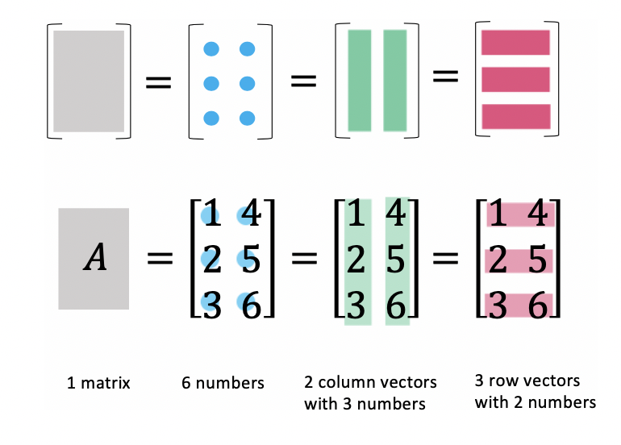

# the art of linear algebra

## 理解矩阵

矩阵的 4 个视角，

1 个矩阵
m\*n 个数字
m 个行向量
n 个列向量

## 向量 乘以 向量

行向量乘以列向量通常指内积（或点积），其结果是一个标量。

$$
\begin{bmatrix} 1& 2& 3\end{bmatrix}
\begin{bmatrix} x_1 \\ x_2 \\ x_3 \end{bmatrix}
= x_1 + 2x_2 + 3x_3
$$

列向量`(1*m)`乘以行向量`(n*1)`，结果是一个秩为1的矩阵。 一般称为外积矩阵或直积矩阵

$$
\begin{bmatrix}1\\ 2\\ 3\end{bmatrix}
\begin{bmatrix}x& y\end{bmatrix}
= \begin{bmatrix}x & y \\ 2x& 2y \\ 3x& 3y\end{bmatrix}
$$
