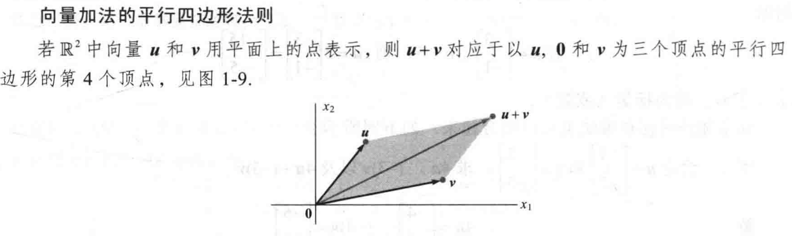
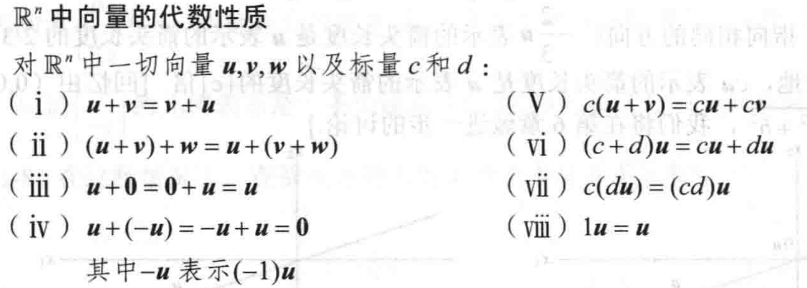
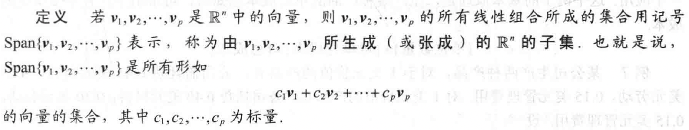
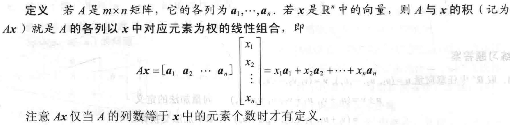
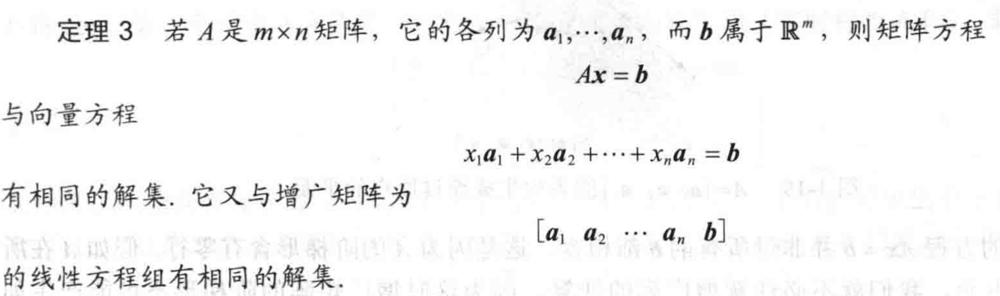
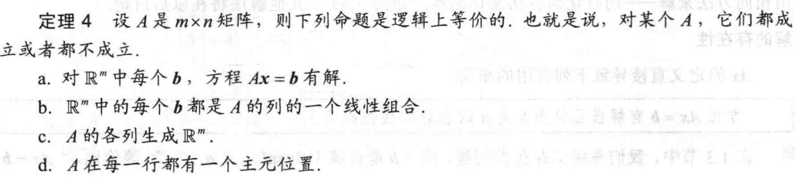
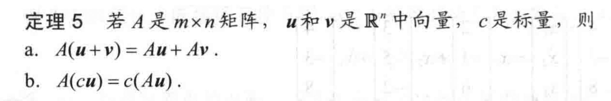
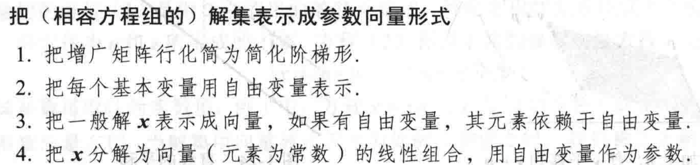

# 线性代数中的线性方程组

## 线性方程

包含变量$x_1,x_2,x_3,...,x_n$的线性方程形如$$a_1x_1 + a_2x_2 + ... + a_nx_n = b$$
其中$b,a_1,a_2,...a_n$等是实数或者复数（通常是已知数）。

**线性方程组**是由一个或几个包含相同变量的线性方程组成

方程组所有可能的解的合集称为线性方程组的**解集**

若两个线性方程组有相同的解集，则这两个线性方程组称为**等价的**

一个线性方程组有：

- **相容的** （一个解或无穷多个解）
- **不相容的** （无解）

系数矩阵：方程组中每一个变量的系数对其一列的矩阵
增广矩阵：系数矩阵再加一列（方程组右侧的常数）

$m \times n$ 矩阵是一个有m行n列的数的矩形阵列

**解方程组的思路一般是用一个更容易解的等价方程组（即有相同解集的方程组）代替**。

**初等行变换**：

- （倍加变换） 把某一行换成它与另一行的倍数的和
- （对换变换） 把两行对换
- （倍乘变换） 把某一行的所有元素乘以同一个非零数
  
行变换是可逆的。

**若两个线性方程组的增广矩阵是等价的，则他们具有相同的解集**。

## 行简化和阶梯矩阵

**非零行或列** 指矩阵中至少包含一个非零元素的行或列
**先导元素** 非零行最左侧的第一个非零元素

**定义** 一个矩阵称为阶梯形（或行阶梯形），则性质如下

- 每一非零行都在每一非零行上
- 某一行的先导元素所在的列位于前一行先导元素的右侧
- 某一先导元素所在列的下方元素都是零
  
若还满足一下条件，则称为简化阶梯形（简化行阶梯形）

- 每一非零行的先导元素都是1
- 每一先导元素1是该元素所在列的唯一非零元素

**定理1** 简化阶梯矩阵的唯一性
每个矩阵行等价于唯一的简化阶梯矩阵

**定义** 主元位置
$A$中对应于它的阶梯形中先导元素1的位置
**定义** 主元列
$A$中含有主元位置的列

**定理2** 存在与唯一性定理
线性方程组相容的充要条件是增光矩阵的最右列不是主元列。
即增广矩阵的阶梯形没有形如$\begin{bmatrix}0& ...& b \end{bmatrix}$, $b \neq 0$的行。

若线性方程组相容，则解集有两种情况：

- 没有自由变量，有唯一解
- 有自由变量，有无穷多解

## 向量方程

$R^2$中的向量
仅含有一列的矩阵称为**列向量**，或简称**向量**

$$w = \begin{bmatrix} w_1 \\ w_2 \end{bmatrix}$$

$w_1,w_2$为任意实数，所有两个元素的向量的集记为$R^2$,$R$表示向量的元素都是实数，指数2表示每个向量包含两个元素

$R^2$中两个向量**相等**，当且仅当对应的每个元素相等。

向量加法：
$$
\begin{bmatrix}x_1\\ x_2\end{bmatrix}
+
\begin{bmatrix}y_1\\ y_2\end{bmatrix}=
\begin{bmatrix}x_1+y_1\\ x_2+y_2\end{bmatrix}
$$

标量乘法：
$$
c \times 
\begin{bmatrix}
    x_1 \\
    x_2
\end{bmatrix} =
\begin{bmatrix}
    c \times x_1 \\
    c \times x_2
\end{bmatrix}
$$

向量的几何意义：
坐标系上的点，或者由原点指向点的有向线段。

所有元素都是0 的向量称为零向量。

线性组合：
给定$R^n$中的向量$v_1,v_2,...,v_p$和标量$c_1,c_2,...c_p$向量$y = c_1v_1+c_2v_2+...+c_pv_p$称为向量$v_1,v_2,...,v_p$以$c_1,c_2,...c_p$为权的线性组合

## 矩阵方程$Ax = b$

解的存在性

方程$Ax = b$有解当且仅当$b$是$A$的各列的线性组合

## 线性方程组的解集

线性方程组称为齐次的，若它可写成$Ax =0$的形式，其中$A$是$m \times n$矩阵而0是$R^m$中的零向量

齐次方程$Ax=0$ 有非平凡解当且仅当方程至少有一个自由变量

**定理6** 设方程$Ax = b$对某个$b$是相容的，$p$做为一个特解，则$Ax = b$的解集是所有形如$w = p + v_h$的向量的集，其中$v_h$是齐次方程$Ax = 0$的任意一个解。

