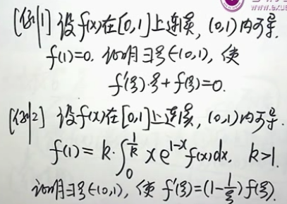
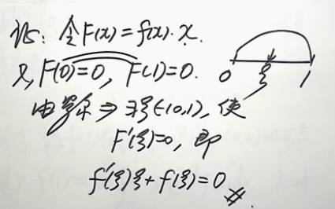

# 考研数学

一、命题的三大特点

1. 注重概念考查
2. 计算能力
3. 全面复习

二、命题的三大题型

1. 计算型
2. 概念型
3. 逻辑推理型（证明型）
4. 应用型

莱布尼兹 -> 伯努利 -> 欧拉 -> 拉格郎日 -> 柯西

1. 计算型

例：设$f(x) = x - sinax,g(x) = bx^3,$当$x \rightarrow 0$时，$f(x) ~ g(x), \Rightarrow a,b=?$

[分析] $\lim_{x \to 0}\frac{x-sinax}{bx^3} \overset{\frac{0}{0}}= 1$ (逆问题)

任何可导函数 $f(x) == \sum a_{n}x^{n}$(泰勒定理)

$$x - sinx \sim \frac{1}{6}x^3 (x \to 0)$$

解: $a = 1, b = \frac{1}{6}$

例：$\lim_{x \to 0}\frac{[sinx - sin(sinx)]sinx}{x^4}$

解：$$x - sinx \sim \frac{1}{6}x^3 (x \to 0)$$
    $$x \to sinx, sinx \to sin(sinx), \Rightarrow \frac{\frac{1}{6} sin^3x \times sinx}{x^4} \Rightarrow \frac{1}{6}$$

***重要公式***

$$x \to 0 \\ sinx = x - \frac{1}{6}x^3 + \bigcirc \\ arcsinx = x + \frac{1}{6}x^3 + \bigcirc \\ tanx = x + \frac{1}{3}x^3 + \bigcirc \\ arctanx = x - \frac{1}{3}x^3 + \bigcirc$$

2. 概念型

$$\lim_{\Delta x \to 0} \frac{f(x_{0} + \Delta x) - f(x_{0})}{\Delta x} \overset{\Delta}= f^{\prime}(x_{0})$$

注：

1. $f^{\prime}(x_{0}) \overset{\Delta}= \lim_{狗 \to 0} \frac{f(x_{0} + 狗) - f(x_{0})}{狗}$

2. $\Delta x \to 0$左右有别

 右导数 $$ \Delta x \to 0^{+}: f_{+}^{\prime}(x_{0})$$
 左导数 $$ \Delta x \to 0^{-}: f_{-}^{\prime}(x_{0})$$

 [th] $f^{\prime}(x_{0}) \Leftrightarrow f_{-}^{\prime}(x_{0}) = f_{+}^{\prime}(x_{0})$

 例：
 设 $f(x)$在$x=0$处连续，$f(0)=0$且 $\lim_{h \to 0} \frac{f(1-cosh)}{h^2} \exists  \overset{?}\Rightarrow  f^{\prime}(0) \exists$

 分析 凡是遇到$f^{\prime}(x_{0}) \Rightarrow $用定义法

 解：$\lim_{h \to 0} \frac{f(1-cosh)}{h^2}  \\
 = \lim_{1-cosh \to 0^+} \frac{f(0 + 1-cosh) - f(0)}{1-cosh}  \frac{1-cosh}{h^{2}} \\
 = \frac{1}{2} f_{+}^{\prime}(0) \exists \neq  f^{\prime}(0) \exists$

 $$ h \to 0 ,cosh <1,cosh \to 1^{-},1-cosh \to 0^{+},$$

  例2：
 设 $f(x)$在$x=0$处连续，$f(0)=0$且 $\lim_{a \to 0} \frac{f(a-sina)}{a^4} \exists  \overset{?}\Rightarrow  f^{\prime}(0) \exists$

 解：
 $\lim_{a \to 0} \frac{f(a-sina)}{a^4} \\
 = \lim_{a \to 0} \frac{f(0 + a-sina) - f(0)}{a^4} \\
 = \lim_{a-sina \to 0} \frac{f(0 + a-sina) - f(0)}{a-sina} \frac{a-sina}{a^4}\\
 = f^{\prime}(0) \infty \exists \Rightarrow f^{\prime}(0) = 0 $

 无穷大的倒数是无穷小

 3. 逻辑推理型（证明型）

- 涉及到$f(x)$的定理

有界性定理 ： 若$f(x)$在$[a,b]$上连续，则$\exists k>0$,使得$|f(x)| \le k, x \in [a,b]$

最值定理 ： 若$f(x)$在$[a,b]$上连续，则$m \le f(x) \le M, x \in [a,b]$，其中$m,M$分别为$f(x)$在$[a,b]$上的最小，最大值。

介值定理 ： 若$f(x)$在$[a,b]$上连续，$m \le \mu \le M$,则$\exists \xi \in [a,b]$,使得$f(\xi) = \mu$

零点定理 :  若$f(x)$在$[a,b]$上连续，$f(a) \cdot f(b) <0$
    则$\exists \xi in (a,b)$使$f(\xi) = 0$

注： 上述定理 只用不证

[例] 设$f(x)$在$[a,b]$上连续，证明$\exists \xi in [a,b]$,使
$\int_{a}^{b} f(x)dx = f(\xi)(b-a)$ 积分中值定理

[结论] $\int_{a}^{b} f(x)dx$ 是一个面积值，即一个数。

故 欲证结论 $\Leftrightarrow f(\xi) = \frac{\int_{a}^{b} f(x)dx}{b-a} \overset{证}= \mu$

三部曲
1:由于$f(x)$在$[a,b]$上连续 $\Rightarrow m\le f(x)\le M $  
2:只要证出 $m \le \mu \le M$
      $$m \le f(x) \le M \\
        \int_{a}^{b}mdx \le \int_{a}^{b}f(x)dx \le \int_{a}^{b}Mdx (dx > 0) \\
        m(b-a) \le \int_{a}^{b}f(x)dx \le M(b-a) \\
        m \le \frac{\int_{a}^{b}f(x)dx}{b-a} \le M
      $$
3:$\Rightarrow \exists \xi \in [a,b]$使 $f(\xi) = \mu$

- 涉及到$f^{\prime}(x)$的定理

费马定理

设$f(x)$在$x=x_{0}$处可导，并取极值 $\Rightarrow f^{\prime}(x_{0}) = 0$

罗尔定理

设$f(x)$满足以下三条 $[a,b]$上连续，$(a,b)$内可导，$f(a)=f(b)$  $\\ \Rightarrow \exists \xi \in (a,b)$使$f^{\prime}(\xi) = 0$

求导公式逆用法 $(u+v)^{\prime} = u^{\prime}v+uv^{\prime}$

取$u=f(x),v=x$,令$F(x)= f(x) \cdot x \\
\Rightarrow F^{\prime}(x)=(f(x) \cdot x)^{\prime} \\
= f^{\prime}(x) \cdot x + f(x) \cdot 1 \\
\Rightarrow F^{\prime}(\xi)= f^{\prime}(\xi) \cdot \xi + f(\xi) = 0$

取$u=f(x),v=e^{nx}$,令$F(x)= f(x) \cdot e^{nx} \\
\Rightarrow F^{\prime}(x)=(f(x) \cdot e^{nx})^{\prime} \\
= f^{\prime}(x) \cdot e^{nx} + f(x) \cdot e^{nx} \cdot n \\
= e^{nx}[f^{\prime}(x)+nf(x)] \\
\Rightarrow F^{\prime}(\xi)= e^{nx}[f^{\prime}(\xi)+nf(\xi)] = 0$

取$u=f(x),v=e^{\varphi (x)}$,令$F(x)= f(x) \cdot e^{\varphi (x)} \\
\Rightarrow F^{\prime}(x)=(f(x) \cdot e^{nx})^{\prime} \\
= f^{\prime}(x) \cdot e^{\varphi (x)} + f(x) \cdot e^{\varphi (x)} \cdot \varphi^{\prime}(x) \\
= e^{\varphi (x)}[f^{\prime}(x)+\varphi^{\prime (x)}f(x)] \\
\Rightarrow F^{\prime}(\xi)= e^{\varphi (\xi)}[f^{\prime}(\xi)+\varphi^{\prime}(\xi)f(\xi)] = 0$

拉格朗日中值定理

设$f(x)$满足以下 $[a,b]$上连续，$(a,b)$内可导  $\\
\Rightarrow \exists \xi \in (a,b)$使$f^{\prime}(\xi) = \frac{f(b)-f(a)}{b-a}$

柯西中值定理

设$f(x)$满足以下 $[a,b]$上连续，$(a,b)$内可导 ,$g^{\prime}(x) \neq 0$   $\\
\Rightarrow \exists \xi \in (a,b)$使$\frac{f(b)-f(a)}{g(b)-g(a)} = \frac{f^{\prime}(\xi)}{g^{\prime}(\xi)}$
